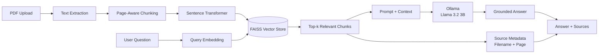

<div align="center">

# ✦ RAGify

**AI Document Assistant — turn your PDFs into an intelligent, searchable knowledge base with grounded answers and page-level citations.**

An end-to-end Retrieval-Augmented Generation (RAG) application built with FastAPI, LangChain, FAISS, Sentence Transformers, and Ollama.

[](https://www.python.org/)
[](https://fastapi.tiangolo.com/)
[](https://www.langchain.com/)
[](https://github.com/facebookresearch/faiss)
[](https://www.docker.com/)
[]
[](#license)

</div>

---

## 📸 Screenshot

<div align="center">
  
</div>

> **Note:** Run the app locally and replace `docs/demo.png` with your own screenshot of the working UI (upload a PDF, ask a question, and capture the answer + citations). This placeholder path already renders here once the file exists — no other change needed.

---

## Table of Contents

- [Overview](#overview)
- [Features](#features)
- [Architecture](#architecture)
- [RAG Workflow](#rag-workflow)
- [Technology Stack](#technology-stack)
- [Project Structure](#project-structure)
- [Setup](#setup)
- [Environment Variables](#environment-variables)
- [Running Locally](#running-locally)
- [Running with Docker](#running-with-docker)
- [API Reference](#api-reference)
- [Example Usage](#example-usage)
- [Testing](#testing)
- [Limitations](#limitations)
- [Future Improvements](#future-improvements)
- [Interview Q&A](#interview-qa)
- [License](#license)

---

## Overview

**RAG Document Q&A** lets a user upload a PDF, then ask natural-language questions about it. Instead of sending the whole document to an LLM, the system retrieves only the most relevant chunks via vector similarity search and grounds the model's answer in that retrieved context — reducing hallucination and making every answer traceable back to a specific page.

Built as a focused, interview-ready portfolio project: clean architecture, real error handling, an automated test suite, and no unnecessary complexity.

## Features

- 📤 **PDF upload** with validation — file type, size limits, empty/unreadable file handling
- ✂️ **Smart chunking** — page-aware text splitting with configurable size and overlap
- 🔎 **Semantic retrieval** — FAISS vector search over local Sentence Transformer embeddings
- 🤖 **Grounded answers** — the model is instructed to answer only from retrieved context, and to say clearly when it can't find something
- 📍 **Accurate citations** — sources are built from real retrieval metadata (filename + page number), never invented by the LLM
- 🔐 **Local-first AI** — uses local Sentence Transformer embeddings and Ollama for LLM inference
- 🎨 **Simple frontend** — dependency-free HTML/CSS/JS, no build step
- 🧪 **Testable** — pytest-based automated tests with isolated test storage
- 🐳 **Docker-ready** — containerization support for reproducible deployment

## Architecture

RAGify uses a modular **Retrieval-Augmented Generation** pipeline that separates document ingestion, semantic retrieval, local LLM generation, and source attribution.

<div align="center">


</div>

### End-to-End Flow

```text
PDF
 ↓
Text Extraction
 ↓
Page-Aware Chunking
 ↓
Sentence Transformer Embeddings
 ↓
FAISS Vector Store
 ↓
User Question
 ↓
Query Embedding
 ↓
Similarity Search
 ↓
Relevant Context
 ↓
Prompt Construction
 ↓
Ollama / Llama 3.2 3B
 ↓
Grounded Answer
 ↓
Source + Page Citations
```

### System Flow



### Application Layer

```text
User
  │
  ▼
RAGify Web Interface
  │
  ▼
FastAPI Backend
  ├── PDF Ingestion
  ├── RAG Retrieval
  └── Question Answering
  │
  ▼
AI Response
  ├── Grounded Answer
  ├── Source Document
  └── Page Reference
```

## RAG Workflow

| Step | What Happens |
|---|---|
| **1. Ingest** | A PDF is uploaded, split into pages, cleaned, and chunked with configurable size and overlap while preserving page metadata. |
| **2. Index** | Each chunk is embedded locally with Sentence Transformers and stored in a FAISS index with filename and page metadata. |
| **3. Retrieve** | A user's question is embedded the same way; FAISS returns the top-k most similar chunks. |
| **4. Generate** | Retrieved chunks are inserted into a dedicated prompt template instructing the model to answer only from that context. |
| **5. Cite** | Source citations are built directly from retrieved chunks' metadata — never parsed from the LLM's own output — so citations are always accurate. |

## Technology Stack

| Layer | Technology |
|---|---|
| Backend | FastAPI · Uvicorn · Pydantic |
| RAG orchestration | LangChain |
| LLM | Ollama · Llama 3.2 3B |
| Embeddings | `sentence-transformers/all-MiniLM-L6-v2` |
| Vector store | FAISS |
| PDF processing | `pypdf` via LangChain's `PyPDFLoader` |
| Frontend | HTML · CSS · vanilla JavaScript |
| Testing | pytest |
| Deployment | Docker |

## Project Structure

```
rag-document-qa/
├── app/
│   ├── main.py                  # FastAPI app, static frontend serving
│   ├── config.py                 # env-var based settings, provider selection
│   ├── api/routes.py             # /health, /documents/upload, /ask
│   ├── schemas/schemas.py        # request/response models
│   ├── services/
│   │   ├── pdf_service.py        # validate, save, extract PDF text
│   │   ├── ingestion_service.py  # upload -> chunk -> index pipeline
│   │   └── qa_service.py         # retrieval -> prompt -> LLM -> citations
│   ├── rag/
│   │   ├── chunking.py
│   │   ├── embeddings.py         # local Sentence Transformer embeddings
│   │   ├── vector_store.py       # FAISS create/load/save
│   │   └── retriever.py
│   ├── prompts/qa_prompt.py      # prompt template, kept separate from logic
│   └── utils/logger.py
├── frontend/                     # index.html, style.css, script.js
├── tests/                        # pytest suite (16 tests)
├── docs/                         # demo + architecture images
├── data/                         # uploads + FAISS index (gitignored)
├── requirements.txt
├── requirements-dev.txt          # + pytest, fpdf2 (test-only)
├── .env.example
├── Dockerfile
└── .gitignore
```

## Setup

### 1. Clone and enter the project

```bash
git clone <your-fork-url>
cd rag-document-qa
```

### 2. Create a virtual environment

```bash
python -m venv venv
source venv/bin/activate      # Windows: venv\Scripts\activate
```

### 3. Install dependencies

```bash
pip install -r requirements.txt
```

### 4. Configure environment variables

```bash
cp .env.example .env
```

Then edit `.env` — see below.

## Environment Variables

The current working implementation uses **local Sentence Transformer embeddings + Ollama** for LLM inference.

```env
LLM_PROVIDER=ollama
EMBEDDING_PROVIDER=local
OLLAMA_MODEL=llama3.2:3b
```

No hosted API key is required for the current local setup.

> **Development note:** The architecture is provider-friendly. OpenAI was initially considered, but the working implementation uses local embeddings and Ollama to avoid API quota dependency during development.

See `.env.example` for the full list of configurable values such as chunk size, retrieval `top_k`, and file-size limits.

## Local AI Runtime

RAGify currently uses **Ollama** with **Llama 3.2 3B** for local LLM inference.

Pull the model:

```bash
ollama pull llama3.2:3b
```

Verify:

```bash
ollama list
```

Start the server when needed:

```bash
ollama serve
```

The local API is expected at:

```text
http://127.0.0.1:11434
```

> **Windows note:** Keep Ollama running while using the RAG application.

## Running Locally

```bash
python -m uvicorn app.main:app --reload
```

Open **http://localhost:8000** — the frontend is served directly from the API. Upload a PDF, ask a question, and see the answer with its source citations.

## Running with Docker

```bash
docker build -t rag-qa .
docker run -p 8000:8000 --env-file .env rag-qa
```

Then open **http://localhost:8000** as above.

## API Reference

| Method | Endpoint | Description |
|---|---|---|
| `GET` | `/health` | Health check + whether a vector store currently exists |
| `POST` | `/documents/upload` | Upload a PDF; extracts, chunks, and indexes it |
| `POST` | `/ask` | Ask a question; returns an answer and source citations |

## Example Usage

```bash
# Upload a document
curl -X POST http://localhost:8000/documents/upload \
  -F "file=@sample.pdf"

# Ask a question
curl -X POST http://localhost:8000/ask \
  -H "Content-Type: application/json" \
  -d '{"question": "What is the main conclusion of this document?"}'
```

**Example `/ask` response:**

```json
{
  "answer": "The document concludes that ...",
  "sources": [
    { "source": "sample.pdf", "page": 2 },
    { "source": "sample.pdf", "page": 5 }
  ]
}
```

## Testing

```bash
pip install -r requirements-dev.txt
pytest tests/ -v
```

All 16 tests run without any real API key or cost — LLM and embedding calls are mocked. Each test gets its own isolated temp storage directory, so tests never interfere with one another.

## Limitations

- No OCR — scanned/image-only PDFs won't extract text.
- No conversation memory — each question is answered independently.
- Single local FAISS index — not designed for multi-tenant or very large-scale document sets.
- No authentication — not intended for public deployment as-is.

## Future Improvements

- Conversation memory for natural follow-up questions
- Multiple simultaneous document collections (workspaces)
- OCR fallback for scanned PDFs
- Streamed, token-by-token responses in the frontend
- A managed vector database (e.g. Pinecone) for multi-instance deployments

## Interview Q&A

<details>
<summary><strong>What is RAG, and why use it instead of sending the whole document to the LLM?</strong></summary>
<br>
RAG retrieves only the most relevant chunks of a document and includes those in the prompt, instead of the whole document. This keeps prompts small (cheaper, faster), works around context-window limits for large documents, and grounds answers in specific retrieved text rather than relying on the model's parametric memory.
</details>

<details>
<summary><strong>Why is chunking necessary?</strong></summary>
<br>
Embeddings work best over focused, coherent pieces of text. A single embedding for an entire document loses granularity — a question about page 5 would compete with unrelated content from page 50 in the same vector. Chunking lets retrieval target the actually relevant passage.
</details>

<details>
<summary><strong>Why embeddings, and what is a vector database?</strong></summary>
<br>
Embeddings turn text into numeric vectors where semantic similarity corresponds to spatial closeness. A vector database (FAISS here) stores these vectors and can quickly find the ones closest to a query's embedding — that's the "retrieval" in RAG.
</details>

<details>
<summary><strong>Why FAISS specifically?</strong></summary>
<br>
It's a fast, well-established local similarity-search library with no external service dependency, which keeps this project simple to run and deploy while still demonstrating real vector-search concepts.
</details>

<details>
<summary><strong>How does similarity search work?</strong></summary>
<br>
The user's question is embedded into the same vector space as the document chunks. FAISS computes distance between the query vector and all stored vectors, and returns the closest matches.
</details>

<details>
<summary><strong>How is LangChain used here?</strong></summary>
<br>
For PDF loading (<code>PyPDFLoader</code>), text splitting (<code>RecursiveCharacterTextSplitter</code>), the FAISS integration, the embeddings/chat model wrappers, and composing the prompt → LLM chain.
</details>

<details>
<summary><strong>How is prompt engineering applied?</strong></summary>
<br>
A dedicated system prompt instructs the model to answer only from the provided context, explicitly say when the answer isn't in the documents, and avoid fabricating information — kept in its own module for clarity and easy iteration.
</details>

<details>
<summary><strong>How does source citation work?</strong></summary>
<br>
Citations are built directly from the metadata (filename, page number) attached to the chunks that were actually retrieved — never generated or guessed by the LLM. This guarantees citations are accurate.
</details>

<details>
<summary><strong>Why FastAPI?</strong></summary>
<br>
Async support, automatic request validation via Pydantic, and automatic OpenAPI docs — a good fit for a small, well-typed API service.
</details>

<details>
<summary><strong>How are errors handled?</strong></summary>
<br>
Custom exceptions (<code>PDFValidationError</code>, <code>PDFExtractionError</code>, <code>NoDocumentsIndexedError</code>) are caught at the API layer and translated into clear HTTP status codes and messages (400 for bad input, 422 for unprocessable PDFs, 502 for LLM/API failures).
</details>

<details>
<summary><strong>How could this be improved further?</strong></summary>
<br>
Conversation memory, OCR support, streaming responses, and a managed vector database for scaling beyond a single instance — see <a href="#future-improvements">Future Improvements</a>.
</details>

<details>
<summary><strong>Why does RAGify use Ollama instead of OpenAI in the current implementation?</strong></summary>
<br>

The architecture is provider-friendly, but the current working implementation uses local Sentence Transformer embeddings and Ollama for Llama 3.2 3B inference. This removes dependency on hosted API quotas during development while keeping retrieval and generation modular.

</details>

<details>
<summary><strong>What embedding model is currently used?</strong></summary>
<br>

RAGify currently uses <code>sentence-transformers/all-MiniLM-L6-v2</code> through a LangChain-compatible local embeddings wrapper.

</details>

<details>
<summary><strong>What happens if Ollama is not running?</strong></summary>
<br>

The FastAPI application cannot reach the local LLM runtime, so question-answering requests will fail. Start Ollama and make sure <code>llama3.2:3b</code> is available before asking questions.

</details>

## License

This project is available under the [MIT License](LICENSE) — free to use, modify, and build on for your own learning or portfolio.

---

<div align="center">

Built by **Md. Sakender Saikot**
<br>
<sub>Add your LinkedIn / GitHub / Portfolio links here once you push this to your own repo.</sub>

</div>
